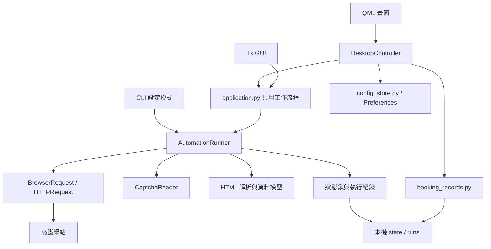
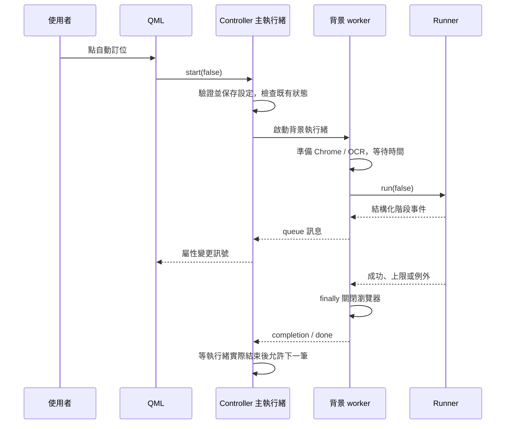
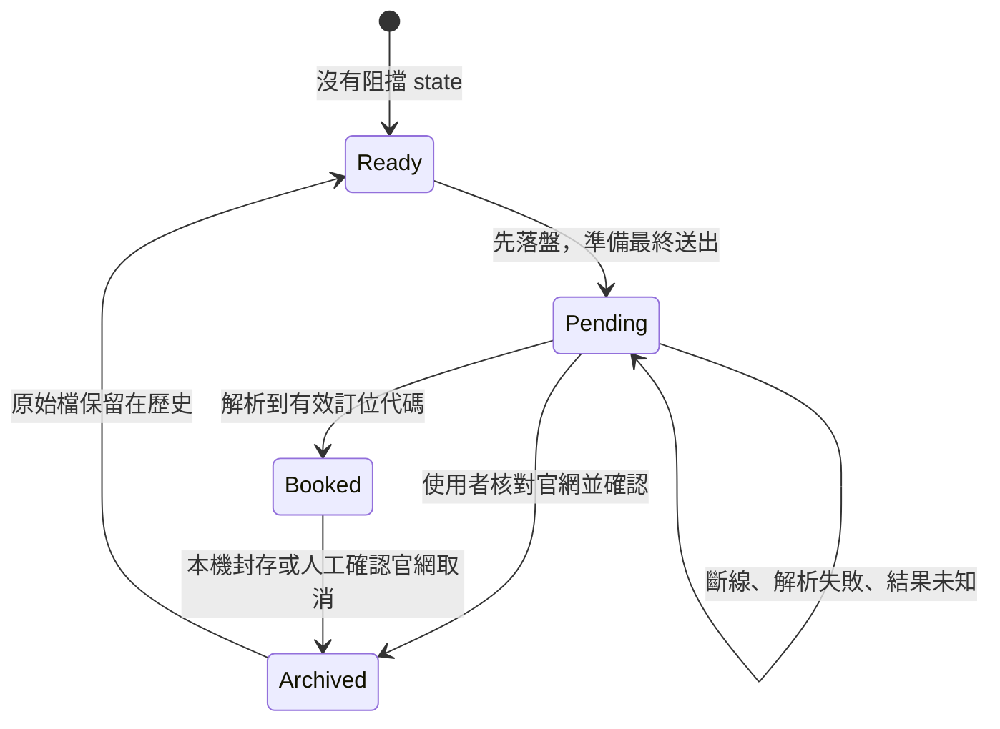

# 從零理解 Travel Desk：開發設計、架構與實作指南

本文件以 **0.3.1 的原始碼，以及 2026-10-03 的清理結果**為基準。對象是第一次接觸這個專案、希望理解「為什麼這樣設計」以及「程式實際怎麼執行」的讀者。

這是可檢查的設計說明與程式導讀，不是每一次開發對話的逐字紀錄。文中分清楚已實作的行為、歷史相容功能，以及未完成的目標；不要把架構圖中的概念誤認為已經存在的獨立類別或服務。

## 目錄與閱讀路線

1. [產品邊界與設計原則](#1-產品邊界與設計原則)
2. [先補齊必要觀念](#2-先補齊必要觀念)
3. [準備可安全學習的環境](#3-準備可安全學習的環境)
4. [整體分層與依賴](#4-整體分層與依賴)
5. [入口與啟動](#5-入口與啟動)
6. [從按鈕追到背景工作](#6-從按鈕追到背景工作)
7. [設定的轉換、驗證與保存](#7-設定的轉換驗證與保存)
8. [查票與訂位完整流程](#8-查票與訂位完整流程)
9. [瀏覽器傳輸與 HTML 解析](#9-瀏覽器傳輸與-html-解析)
10. [OCR 與評估](#10-ocr-與評估)
11. [失敗、重試與停止](#11-失敗重試與停止)
12. [防重送與資料一致性](#12-防重送與資料一致性)
13. [紀錄、封存與取消](#13-紀錄封存與取消)
14. [介面、狀態與執行緒](#14-介面狀態與執行緒)
15. [個資與輸出邊界](#15-個資與輸出邊界)
16. [測試怎麼證明行為](#16-測試怎麼證明行為)
17. [打包、安裝與更新](#17-打包安裝與更新)
18. [一步步增加功能](#18-一步步增加功能)
19. [除錯方法與常見誤解](#19-除錯方法與常見誤解)
20. [練習與後續改善](#20-練習與後續改善)

搭配閱讀：[逐檔用途與清理紀錄](file-inventory.md)、[操作手冊](desktop.md)、[JSON 欄位說明](automation.md)、[測試歷史](verification.md)。

第一次閱讀建議分三輪：先看 1～8 節，理解一筆任務；再看 9～15 節，理解網站、狀態與失敗；最後看 16～20 節，開始修改與測試。不要一開始就逐行讀完整個 `Main.qml`。

## 1. 產品邊界與設計原則

### 1.1 這個程式做什麼

使用者先設定單程行程、票數、時段及啟動時間。程式在本機開啟獨立瀏覽器工作階段，查詢符合條件的車次；可選擇查到即停止，或送出訂位並保存訂位代碼。**自動訂位不付款。**

目前主要產品是 Windows 的 PySide6 / Qt Quick 桌面 App。另保留設定檔 CLI、互動式 CLI 與舊 Tk GUI。它不是手機 App，也不是雲端代訂服務；關閉電腦後沒有伺服器替你繼續執行。

### 1.2 為什麼開發順序先處理核心，再處理介面

開發要解決的問題有依賴關係：

| 階段 | 先要回答的問題 | 本專案的落點 |
| --- | --- | --- |
| 網站流程 | 首頁、查詢、選車、送出，各自需要什麼表單？ | `remote/`、`controller/`、`view_model/` |
| 自動化 | 如何預先設定、排程、選車及結束？ | `automation.py` |
| 可靠性 | 送出後斷線，能不能再次訂票？ | state 檔、`record_lock.py` |
| 可觀察性 | 發生在哪個階段？結果存在哪裡？ | `run_records.py` |
| 易用性 | 使用者不看 JSON 或終端也能操作嗎？ | `application.py`、Qt controller、QML |
| 發行 | 沒有 Python 的電腦怎麼執行？ | PyInstaller、Inno Setup、CI |

如果在不知道訂位是否成功時只顯示漂亮的錯誤視窗，核心問題仍然存在。因此，訂位狀態與防重送規則優先於視覺效果。

### 1.3 貫穿設計的規則

- UI 只提出操作與呈現狀態，不能以「按鈕被點擊」當成訂位成功。
- 網頁沒回應，不等於網站沒收到訂位。
- 本機封存、官網取消、退票退款是不同操作。
- 能重試的查詢與不能盲目重送的交易，要在程式結構上分開。
- 測試先使用假資料，不能靠反覆建立真實訂位來驗證邏輯。
- 改善功能應先保留可診斷的結果，而不是刪掉狀態讓程式看起來又能跑。

## 2. 先補齊必要觀念

| 名詞 | 在這個專案的意思 | 可以直接看的例子 |
| --- | --- | --- |
| 模組 | 一個可匯入的 Python 檔 | `captcha.py` |
| 套件 | 組織多個模組的目錄，通常有 `__init__.py` | `thsr_ticket/desktop/` |
| 入口 | 使用者或作業系統首先呼叫的程式 | `desktop/__main__.py` |
| Model | 經過驗證的資料結構 | `AutomationConfig`、`BookingModel` |
| Controller | 接收畫面操作、協調服務、更新畫面資料 | `DesktopController` |
| Adapter | 將一種介面轉換成另一種 | `BrowserRequest` 將頁面快照轉為 `Response` |
| Signal / Slot | Qt 的狀態通知與可呼叫方法 | `changed`、`start()` |
| Queue | 讓工作執行緒安全傳遞訊息給主執行緒 | `self._messages` |
| Fixture | 測試準備好的物件或 HTML 樣本 | `unittest/fixtures/`、pytest `runner` |
| 原子替換 | 先寫完整暫存檔，再替換目的檔 | `atomic_json()` |
| 鎖 | 阻止同時操作同一份資料 | `record_lock()` |
| 冪等 | 同一操作重做，不會產生額外效果 | 本專案**不能假設**官網送出訂位具備此性質 |

看到 `self` 可以先理解為「這個物件自己的資料」。例如同一個 `AutomationRunner` 持有本次設定、client、reader、目前階段；不同任務不應靠共用全域變數保存這些內容。

看到 `with ...:` 要注意離開區塊時會做什麼：它可能負責關閉檔案、釋放鎖，或記錄階段時間。這對錯誤時的清理尤其重要。

## 3. 準備可安全學習的環境

本工作區的 Python 是 `.venv\windows\Scripts\python.exe`。若在全新 clone 建立 `.venv`，路徑通常是 `.venv\Scripts\python.exe`；二者不要混用。

以下都在專案根目錄執行。先看幫助與離線測試，不需要填真實乘客資料：

```powershell
.\.venv\windows\Scripts\python.exe -m thsr_ticket.main --help
.\.venv\windows\Scripts\python.exe -m pytest -q -p no:cacheprovider
.\.venv\windows\Scripts\python.exe -m flake8 --config .config/flake thsr_ticket scripts -j 1
```

若沒有環境，依 [README](../README.md) 建立 venv；開發桌面及打包功能可安裝 `requirements-build.txt`。它包含桌面與自動化依賴鏈，不需要把每份 requirements 重複裝一次。

若 pytest 的系統暫存目錄被鎖住，指定一個**全新且可丟棄**的路徑：

```powershell
$testDir = Join-Path (Get-Location) ('build/learning-tests-' + [guid]::NewGuid().ToString('N'))
.\.venv\windows\Scripts\python.exe -m pytest -q -p no:cacheprovider --basetemp $testDir
```

`--basetemp` 不是放正式資料的地方；pytest 可能清理該目錄，不能指定專案根目錄、`.runs` 或個人資料夾。

要看畫面又不讀取自己的設定，可使用假資料預覽：

```powershell
.\.venv\windows\Scripts\python.exe -m scripts.preview_desktop --scale 1.25
```

它以 Qt offscreen 模式產生圖片，輸出在 `build/preview/`，不會訂票。正常啟動 `python -m thsr_ticket.desktop` 則會依偏好載入實際設定，二者用途不同。

## 4. 整體分層與依賴



這不是完全教科書式的單向分層：`DesktopController` 目前還直接做設定存取、紀錄管理與更新檢查；`AutomationRunner` 也同時協調選車與本機持久化。它的規模仍適合單任務桌面程式，尚未拆成很多 service/repository 類別。

### 4.1 為什麼不讓 QML 直接訂票

畫面改版不應影響「送出後不能重送」的規則。將規則放在 Python 核心，CLI、Tk、Qt 才能共用並使用 pytest 驗證。QML 不需要知道 HTML 表單的欄位名稱。

### 4.2 為什麼有 application.py

它處理畫面表單轉換、背景工作、停止及訊息輸出，不依賴 Qt 或 Tk。若把這些都寫進 Qt 的 Slot，測試時就得為每個查票情境啟動視窗，而且更換 UI 框架時又要重寫。

### 4.3 歷史路徑也要看懂

不帶 `--config` 的互動式 CLI 走 `controller/booking_flow.py`，不是 `AutomationRunner`。舊 `model/web/` 有部分資料類別只剩相容性測試，另一些對照表仍被互動式 CLI 的 view 使用。**不能因為 Qt 沒直接 import 某個檔案，就認定整個專案都不用它。**

後文的 state/runs、跨程序防重送與排程重試，主要描述 `AutomationRunner` 路線（設定檔 CLI 與 GUI）。舊互動式 CLI 沒有同一套完整的 state/runs 保護，只保留其既有流程、錯誤提示與 TinyDB 歷史；不能把新版的保證直接套用到所有舊入口。

## 5. 入口與啟動

| 指令／檔案 | 執行路線 |
| --- | --- |
| `python -m thsr_ticket.desktop` | Python 尋找 `desktop/__main__.py`，呼叫 `main()` |
| `thsr-ticket-gui` | `setup.py` 的 GUI entry point，導向同一個 Qt `main()` |
| `desktop_launcher.py` | PyInstaller 用的小入口，導向 Qt `main()` |
| `python -m thsr_ticket.main --config ...` | 載入 `AutomationConfig`，建立 client 與 reader，執行 runner |
| `python -m thsr_ticket.main` | 舊互動式 CLI，逐步輸入 |
| `python -m thsr_ticket.gui` | 舊 Tk 介面，保留相容性 |

Qt 啟動依序完成：解析 `--self-test`、建立 Windows 安裝保護 mutex、建立 `QApplication`、指定產品與版本、找使用者資料目錄、建立 controller、將 `backend` 傳給 QML engine，最後進入事件迴圈。

`app.exec()` 是事件迴圈：它持續處理按鍵、重繪、計時器及訊號，不是一次跑完就退出的腳本。

`--self-test` 使用臨時資料目錄，載入 QML、OCR、Playwright 與 DPAPI，產生檢查 JSON。它證明資源能載入，**不代表官網訂位成功**，也不代表乾淨電腦上所有操作都已驗收。

Windows 的 `TravelDeskRunning` mutex 主要供安裝與解除安裝檢查。它目前不是完整的「只允許一個 App 視窗」機制，不要把它與訂位資料鎖混為一談。

## 6. 從按鈕追到背景工作

建議在 IDE 中依序搜尋下面幾個符號：

```text
Main.qml 的 backend.start(...)
  → DesktopController.start(query_only)
  → save_config() / form_config()
  → threading.Thread(... run_background ...)
  → wait_until(...)
  → AutomationRunner.run(query_only)
  → queue 中的 event / completion / done
  → DesktopController.poll()
  → changed.emit()
  → QML 更新畫面
```

`query_only=True` 與 `False` 共用查詢路線，差別在找到車次後是否呼叫 `book()`。這樣不用維護兩套幾乎相同的查票邏輯。



注意最後一步：收到 `done` 與執行緒完全退出可能差幾個指令。controller 會檢查執行緒是否仍存活，避免前一個工作還沒清理完就開下一個。

## 7. 設定的轉換、驗證與保存

### 7.1 同一個欄位有三種表示

以出發站為例：畫面用「台北」、設定模型用整數 `2`、送到網站時用表單參數名稱 `selectStartStation`。同樣是出發站，但各層的格式與責任不同。

| 層次 | 範例 | 負責程式 |
| --- | --- | --- |
| 表單 | `adult_tickets = '1'`、`start_station = '台北'` | QML、controller |
| 設定 | `adult_tickets = 1`、`start_station = 2` | `application.form_config()` |
| 官網表單 | 票種編碼及 alias 欄位 | `AutomationConfig.build_booking()`、`param_schema.py` |

`model.json(by_alias=True)` 的 `by_alias` 讓 Python 內部可讀名稱轉成網站使用的名稱。修改時不能只改畫面的標籤，忘了設定與官網格式。

### 7.2 驗證放在哪裡

`form_config()` 處理文字轉數字等基本轉換，失敗時用 `FieldError` 指出欄位。`AutomationConfig` 使用 Pydantic v1 檢查查詢輪數、間隔、時間區間、票數與行程，並重用網站參數模型的規則。

例如「開始時間晚於搭車日期」是跨欄位規則，不能只靠日期輸入框各自驗證。UI 的行內錯誤是方便使用者；核心模型仍要驗證，因為 CLI 可以繞過 UI。

`extra='forbid'` 表示多出不認識的設定鍵也會失敗，能提早發現拼字錯誤。增加欄位時要考慮舊設定沒有它，通常需要合理預設值。

### 7.3 保存與未儲存提醒

controller 比較目前表單、上次保存的表單與加密選項，決定 `dirty`。載入其他設定或關閉前，會提供保存、捨棄、取消。

`config_store.py` 讀取一般 JSON 或 Windows DPAPI 保護的欄位，再交給模型。保存時用原子 JSON 寫入，避免半份設定。

`preferences.json` 只記住最近使用的設定絕對路徑。它不是另一份訂位設定，也不保存乘客證號。匯入設定保留原本位置，是為了讓其關聯的 `.state.json`、`.runs/` 不會被遺落。

## 8. 查票與訂位完整流程

核心在 [`automation.py`](../thsr_ticket/automation.py) 的 `run()`、`_run()`、`book()`。

1. `run()` 建立本次執行紀錄並取得狀態鎖。
2. `_run()` 在自動訂位模式檢查有無既存 state。
3. 每輪讀首頁，解析本次 session 的選項值。
4. 取得本次頁面的驗證碼圖片，送給本機 OCR。
5. 沒有可靠候選就等待下一輪；模型故障則停止。
6. 建立查票表單，送出查詢。
7. 明確驗證碼錯誤或無符合車次可繼續；不認識的錯誤不能假裝是沒票。
8. `select()` 依時段及偏好車次選擇；有指定 `train_ids` 時，清單順序代表優先順位。
9. 只查票模式到這裡結束。
10. 自動訂位模式進入 `book()`：選車、解析確認頁、建立乘客資料模型。
11. **先建立並同步寫入 `submission_pending`，才送最終訂位。**
12. 解析到有效訂位代碼後保存結果、更新狀態為 `booked`，結束。

「每輪等待 1 秒」不等於每秒一定查一次。實際週期包含網頁載入、圖片下載、OCR、網站回應，再加等待時間。這是循序流程，不是每個固定時刻都開一條新請求。

排程同樣不是硬即時保證。worker 會先準備瀏覽器及 OCR，再等到時間；電腦休眠、網路、作業系統排程都會影響實際送出時間。

## 9. 瀏覽器傳輸與 HTML 解析

### 9.1 HTTPRequest 與 BrowserRequest

`HTTPRequest` 用 requests session 送出 HTTP，保存動態 form action 與 hidden fields。`BrowserRequest` 繼承其介面，但實際在 Chrome 中填欄位、操作表單，然後產生類似 requests `Response` 的快照。

兩種 client 對 runner 提供相同方法：

```text
request_booking_page()
request_security_code_img(...)
submit_booking_form(...)
submit_train(...)
submit_ticket(...)
close()
```

這種邊界讓測試可以用假的 client 替代瀏覽器。Runner 不需要知道某次請求是 requests 還是 Playwright。

### 9.2 為什麼需要獨立瀏覽器

`NativeBrowser` 建立臨時 profile、啟動已安裝 Chrome，並用僅綁定 localhost 的除錯端點供 Playwright 連線。它不使用平常 Chrome 的登入工作階段與個人 profile。

獨立工作階段利於清理，也減少操作到使用者其他分頁的機會；代價是不能假設日常瀏覽器已通過的網站檢測會自動延續到程式中。

### 9.3 網站欄位不是固定常數就夠了

網站的 form action、hidden fields 與 radio 值可能隨頁面變動，程式要從當前 HTML 解析。`_site_url()` 也會確認目的地仍是預期的 HTTPS 網站。

驗證碼圖片取自目前瀏覽器已收到的圖片回應；另外再發一次圖片請求可能取得新碼，造成圖片與 session 對不上。

### 9.4 解析後才交給業務邏輯

`view_model/avail_trains.py` 將 HTML 轉成車次，`booking_result.py` 轉成訂位結果，`error_feedback.py` 解析錯誤區塊。名字雖然叫 view_model，這裡主要是網站 HTML 到 Python 資料的轉換，與 Qt 的 controller 不是同一件事。

網站回傳 HTTP 200，只能代表 HTTP 層成功回應，內容仍可能是驗證碼錯誤或系統公告。因此需要 `check_errors()` 與頁面結構檢查。

## 10. OCR 與評估

目前走 `captcha.py` → ddddocr → ONNX runtime，不是使用專案自行訓練的模型。`standard` / `beta` 由 ddddocr 提供；舊 `ml/` 實驗沒有接入此路線，已在本次清理移除。

`CaptchaReader.prepare()` 先載入一次模型；`recognize()` 接收圖片 bytes，回傳 `CaptchaGuess(text, score)` 或 `None`。

`decode_prediction()` 處理 CTC 輸出、空白時間格、連續重複字元及大小寫合併。**模型分數不是實站辨識正確率。** 候選碼符合四碼格式、分數達標，也可能被網站判錯。

`ocr_benchmark.py` 使用人工標註圖片做離線比較：

| 指標 | 定義 | 為什麼要一起看 |
| --- | --- | --- |
| exact_match_rate | 正確張數 / 全部張數 | 包含未提供候選的情況 |
| coverage | 有提供候選的張數 / 全部張數 | 模型是否經常拒答 |
| accepted_accuracy | 正確張數 / 有候選的張數 | 提供候選時有多可靠 |
| mean_inference_ms | 平均推論時間 | 不含網站載入時間 |

單純把門檻拉高可能讓 accepted accuracy 變高，但 coverage 下降；不能只選漂亮的一個數字。評估方式與標註格式見 [OCR 評估](ocr-evaluation.md)。

## 11. 失敗、重試與停止

### 11.1 先分類，再決定是否重試

| 情況 | 現在的處理 | 理由 |
| --- | --- | --- |
| 無符合車次 | 下一輪查詢 | 尚未送出訂位 |
| 明確查票驗證碼錯誤 | 重新取得首頁與驗證碼 | 舊圖片不可盲目重送 |
| OCR 無可靠候選 | 下一輪；模型無法運作則停止 | 低信心與環境故障不同 |
| 查票 Timeout / ConnectionError / HTTP 502、503、504 | 有限次退避重試 | 暫時性連線故障可能恢復 |
| HTTP 403、429 | 停止 | 不屬於自動重試白名單 |
| WebsiteRejected | 停止並提供固定原因分類 | 不能把所有網站拒絕當沒票 |
| 選車錯誤 | 停止 | 已離開單純查詢流程 |
| 最終送出後錯誤 | 保留 pending，人工核對 | 可能已成立訂位 |

0.3.1 的網路重試在每輪查票區塊，連續第三次網路失敗停止；前兩次至少等待 2、4 秒，若設定的間隔更長則採較長值。每次消耗查詢輪數，不會繞過總上限。這個保護目前固定在程式中，不是可從 JSON 設定的新欄位。

### 11.2 WebsiteRejected 不是「一定超過失敗次數」

這是本專案對網站錯誤區塊的例外名稱。原因可能是日期、驗證碼、工作階段或操作限制。新版 `user_message` 用固定分類說明，避免把可能含個資的原文直接寫進 GUI log；不認識的錯誤會明確標示尚未分類。

### 11.3 停止是合作式的

按停止時設定 `threading.Event`。`StoppableClient` 在每次 client 方法前檢查停止旗標；排程與重試等待透過 `stop.wait(seconds)` 可提前返回。

已進入的同步瀏覽器操作不一定能立即中止，仍受 timeout 與清理時間影響。因此 UI 顯示「正在停止」是有意義的中間狀態。強殺執行緒可能讓瀏覽器、檔案或鎖無法正常釋放。

## 12. 防重送與資料一致性

### 12.1 三種狀態，不只成功與失敗



Pending 不能自動轉成 Ready。關鍵原因是「不知道」不是「沒有」。

### 12.2 為什麼在送出前寫 state

假設順序是先送出，再記錄。如果網站成功、程式在記錄前崩潰，下次啟動就不知道已送過，可能重複訂位。

目前用 `open('x')` 排他建立標記，再 `flush()` 和 `os.fsync()`，接著才送出。極端情況下，標記寫好但請求尚未送出就關機，會留下需要核對的 pending。這是保守取捨，不是可以隨意刪掉的垃圾檔。

### 12.3 鎖、排他建立與原子替換各自不同

| 機制 | 防什麼 | 不保證什麼 |
| --- | --- | --- |
| `record_lock()` | 共用同一設定狀態的程序同時操作 | 不阻止另一份設定對同一旅程下單 |
| `open('x')` | 已有標記卻被覆寫 | 不知道官網是否真正收到請求 |
| `atomic_json()` | 讀到只寫一半的 JSON | 不會讓本機檔案與官網交易變成同一個原子交易 |
| fingerprint | 使用者看過紀錄後，紀錄又變更 | 不是驗證官網結果的簽章 |

鎖使用作業系統的檔案鎖；程序結束後 OS 會釋放鎖，不代表鎖檔一定消失。不要單看 `.operation.lock` 檔是否存在就判定還在執行。

### 12.4 保存結果失敗也不能重訂

若官網已回成功，但 `result.json` 寫入失敗，程式會提示保留結果並避免重送。若更新 booked state 失敗，舊 pending 標記仍保留。不能為了消除磁碟錯誤而重新執行整個訂位流程。

## 13. 紀錄、封存與取消

以某份設定 `booking.local.json` 為例，關聯資料是：

```text
booking.local.json                 行程與乘客設定
booking.local.state.json           防重送與目前已訂位狀態
booking.local.operation.lock       共用操作鎖
booking.local.runs/
  <run_id>/
    events.jsonl                  每行一個執行事件
    result.json                   成功結果；不一定每次都有
  archives/<archive_id>/
    state.json                    原始狀態紀錄
    resolution.json               人工核對結果；一般封存不一定有
```

`run_id` 與 `archive_id` 是本機識別碼，不是官網訂位代碼。事件檔適合逐行追加，結果檔則適合一次原子寫入。

`RunRecords.event()` 只接收程式明確選出的欄位。它不會自動把整個 config 或 HTTP request 轉成 JSON。磁碟事件寫入失敗時會停止後續磁碟記錄，但畫面事件仍可傳遞；診斷失敗不能引發重新訂位。

### 13.1 四種操作的差別

| 操作 | 接觸官網？ | 本機作用 |
| --- | --- | --- |
| 查看紀錄 | 否 | 彙整 state、result 與 archives |
| 移至歷史 | 否 | 封存已成功的本機 state，官網票保留 |
| 處理待確認 | 使用者自行核對 | 保存核對結果，封存 pending |
| 官網取消引導 | 開啟官網，由使用者完成取消 | 使用者確認成功後，保存 `user_verified` 結果並封存 |

0.3.1 **沒有 App 直接送出官網最終取消／退款的自動化**。`openCancellation()` 只是開啟官方管理訂位頁；`confirm_cancelled()` 的函式名稱指記錄人工確認，不是發出取消請求。

`record_entries()` 回傳的 `history`、`resolved` 是 UI 分類，不一定是 state 檔原本的 status。付款期限與票價是當時保存的資料，不會自動與官網同步。

## 14. 介面、狀態與執行緒

### 14.1 QML 怎麼分工

| 元件 | 責任 |
| --- | --- |
| `Main.qml` | 頁面、導覽、對話框、頁面資料綁定 |
| `Field.qml` | 輸入、錯誤提示、密碼眼睛、日期／時間選擇 |
| `AppButton.qml` | 按鈕的共用外觀與互動 |
| `Card.qml` | 卡片容器與標題 |
| `NavIcon.qml` | 側欄向量圖示 |

共用元件可避免每個按鈕各寫一套顏色、間距與 disabled 狀態。`Main.qml` 仍偏大，未來可以按頁面拆檔；本次清理不會為了「檔案少一點」把元件合回去。

### 14.2 Controller 的 Property、Signal、Slot

- `Property`：QML 可以讀取的狀態，例如 `running`、`records`、`phase`。
- `Signal`：通知狀態改變，例如 `changed.emit()`。
- `Slot`：QML 可以呼叫的操作，例如 `start()`、`archive()`。

背景執行緒不能直接改 QML 元件。worker 將訊息放 queue，主執行緒的 QTimer 呼叫 `poll()` 讀取並改 controller 屬性。

| queue 種類 | 用途 |
| --- | --- |
| `text` | 可讀的執行訊息 |
| `phase` | 排程、啟動等簡單狀態 |
| `event` | runner 的階段、車次與次數資訊 |
| `completion` | 完成原因代碼、訊息與復原入口 |
| `done` | 工作完成文字；保留舊 GUI 相容性 |
| `update` | 手動檢查版本的結果 |

已移除舊 `QueueWriter`：worker 現在直接使用 `output` callback，不再依賴全域 stdout 重導向。這讓不同輸出來源較不容易互相干擾。

## 15. 個資與輸出邊界

眼睛圖示只改畫面遮蔽，並非加密。Windows DPAPI 則保護設定檔中的 `personal_id`、`phone_num`；保存為帶有 `protection` 和 Base64 密文的物件。

DPAPI 綁定 Windows 使用者環境，換帳號或電腦不能假設可解密。這也不是防止同一使用者權限下所有程式讀取的完整隔離機制。

訂位代碼、座位、行程與結果檔沒有因此全面加密，舊互動式 CLI 的 TinyDB 歷史也不等同於 DPAPI 設定。備份 `.runs` 與歷史資料仍要當作個人資料處理。

新增日誌時，優先寫「階段、次數、耗時、錯誤類型」，不要直接寫 exception 原文、整份 HTML、config 或 POST payload。UI 畫面需要呈現某些資料，不等於磁碟診斷紀錄也需要保存。

## 16. 測試怎麼證明行為

### 16.1 分層測試

| 測試 | 驗證重點 |
| --- | --- |
| `test_automation.py` | 選車、重試、送出順序、防重送 |
| `test_current_flow.py` | 現有網站解析與互動流程 |
| `test_http_request.py` / `test_browser_request.py` | 動態表單、同站限制、傳輸適配 |
| `test_captcha.py` / `test_ocr_benchmark.py` | 候選解析、門檻與評估指標 |
| `test_run_records.py` | 事件、結果保存與錯誤分類 |
| `test_booking_records.py` | 封存、鎖、fingerprint 與人工確認 |
| `test_desktop.py` | controller 與 QML 載入／畫面 |
| `test_desktop_acceptance.py` | 真正 worker + runner，搭配假的網站 client |
| `test_desktop_release.py` | DPAPI、版本檢查等發行功能 |
| `test_gui.py`、`unittest/model/` | 舊入口與資料模型相容性 |

### 16.2 測試替身不等於把整個流程都假掉

桌面接受測試用 Mock 取代網站回應，但執行真正的 `run_background()` 和 `AutomationRunner`。這能驗證 UI 所用的路線是否保留 pending、是否重送最終訂位、是否關閉 client。

例如「最終送出 Timeout」的核心斷言應是：送出方法只呼叫一次、state 仍為 pending、畫面要求核對。只檢查「有出現錯誤訊息」不夠。

### 16.3 跳過不等於通過

預設 pytest 不執行 `--live` 實站檢查，也不執行需要 Chrome 的 `--browser-tests`。在目前環境，預設回歸結果為 207 通過、11 跳過；以當次實際輸出為準。

`--browser-tests` 使用本機假頁面驗證瀏覽器傳輸，不等於訂真票。`--live` 是明確開啟的官網檢查，初學時不必執行。HTML fixtures 是測試資料，不是證明當前官網永遠不變的契約。

### 16.4 各種「驗證通過」的範圍

設定驗證通過 ≠ 查得到票；模型載入通過 ≠ OCR 一定正確；離線流程通過 ≠ 網站接受；EXE 啟動通過 ≠ 安裝／升級全通過；本機安裝通過 ≠ 遠端乾淨 Windows 通過。

## 17. 打包、安裝與更新

### 17.1 依賴檔怎麼看

```text
requirements-build.txt
  → requirements-desktop.txt
      → requirements-automation-lock.txt
          → requirements-lock.txt
```

`requirements.txt` 是 setup 的基本依賴範圍；`requirements-lock.txt` 固定已驗證環境版本。`requirements-automation.txt` 是較小的選用依賴清單。它們用途不同，不能只因名稱相似就刪掉。

目前基本依賴仍混有 pytest、mypy 等開發工具。這是可改善項，不代表本次已完成 runtime/dev 分離；直接移除會連帶改變安裝契約與 CI。

### 17.2 EXE 怎麼出來

`TravelDesk.spec` 指定 launcher、QML、SVG 圖示、ddddocr 資料與 ONNX runtime 動態庫；`scripts/build_icon.py` 從 SVG 產生 Windows ICO。PyInstaller 輸出整個 `dist/TravelDesk/`。

它是資料夾式 bundle，不是只拷貝 EXE 就能跑。Chrome 本體沒有隨程式一起包入，仍需使用者安裝。

### 17.3 安裝程式怎麼出來

`installer/TravelDesk.iss` 將 bundle 壓成安裝包，使用目前使用者權限安裝。App 資料放使用者資料目錄或原設定路徑，而不是安裝程式目錄。安裝與解除安裝會檢查執行中的 mutex。

`scripts/test_installer.ps1` 使用隔離測試目錄與假 state 驗證安裝、覆蓋安裝、啟動與解除安裝；若偵測已有正式安裝，會拒絕測試，避免碰到現有 App。

### 17.4 更新與發行還不是全自動

`desktop/updates.py` 只在使用者要求時查 GitHub release，使用固定網址，不自動下載並執行更新。Git push 不等於 GitHub Release，沒有正式 release 時可能沒有可更新版本。

`.github/workflows/desktop-release.yml` 是手動觸發的 build / packaged-smoke 工作流程，只上傳 artifacts，不會自動發布正式 Release。程式碼簽章目前未啟用；`scripts/sign_release.ps1` 是保留的未來發行工具。

## 18. 一步步增加功能

### 18.1 範例：新增可設定的查票條件

假設要新增一個真正影響選車的條件，先定義預期行為與舊設定如何相容，再依序檢查：

1. `AutomationConfig`：欄位型別、預設值、驗證規則。
2. `select()` 或查詢模型：條件在本機篩選還是送給官網？
3. `application.FIELDS` / `form_config()`：表單轉換。
4. `desktop.defaults()` / `form_values()`：載入、保存與初始值。
5. QML 與必要的舊 GUI：呈現、輸入與錯誤訊息。
6. `booking.example.json` 和欄位文件：讓使用者知道怎麼設定。
7. 測試：新條件符合、不符合、非法值、舊設定缺欄位。

這不是要求所有功能都改七個檔案，而是避免只改表單後，發現核心沒有採用新值。

### 18.2 範例：新增紀錄操作

先回答：這是本機操作還是官網交易？適用哪些 status？需不需要確認？失敗後如何保留可恢復證據？

本機操作應先在 `booking_records.py` 實作規則、鎖與 stale 檢查，再由 controller 接 Slot，最後做 QML。不要讓 QML 直接刪 state 檔。

若是自動官網取消，需要額外驗證登入後頁面、付款狀態、最終確認及成功回應；取消送出後失聯也需要「取消結果待確認」的設計。現有人工確認不能當成這項功能已完成。

### 18.3 範例：網站改版

先確認錯在傳輸、定位欄位還是解析，不要先調整所有 timeout。用去除個資的樣本建立 fixture；先讓測試重現結構差異，再修改對應 parser / adapter，最後才做受控實站驗收。

## 19. 除錯方法與常見誤解

| 現象 | 先看什麼 | 不要直接做什麼 |
| --- | --- | --- |
| GUI 按啟動沒反應 | 欄位錯誤、`running`、state、controller 的通知 | 刪掉所有紀錄 |
| 第 1 輪 WebsiteRejected | 原因分類、日期與官網狀態 | 把 max_attempts 改成更大就當修好 |
| 第 7 輪斷線 | `events.jsonl` 的 phase、attempt、reason | 認定一定是 OCR 失敗 |
| 訂位成功卻無 result | `result_save_failed`、磁碟權限、state | 再訂一次取得檔案 |
| 舊紀錄一直阻擋 | 官網核對、封存或處理待確認 | 清空 state 內容變成無效 JSON |
| 新程式碼看不到 | 是從 source 啟動，還是安裝版 EXE？ | 以為修改原始碼會自動改 EXE |
| Flake8 很多行長錯誤 | 是否帶 `--config .config/flake` | 立刻改全專案格式 |
| 封存後官網仍有票 | 操作是本機封存還是官網取消 | 把本機卡片消失當成取消成功 |

看事件檔時先找 `run_stopped` 或最後一個 stage，再往前找相同 attempt。事件裡的 `phase` 比泛用的「執行失敗」更適合定位責任。分享紀錄前仍應移除訂位代碼、證號、電話等個資。

## 20. 練習與後續改善

### 20.1 建議練習順序

1. 找到 `query_only` 從 QML 傳到 runner 的每一個位置，用自己的話說明哪裡阻止最終訂位。
2. 執行 `test_transient_query_disconnect_restarts_from_homepage`，理解 Mock 如何第一次逾時、第二次成功。
3. 閱讀 `book()`，畫出寫 pending、送出、解析、寫 result、更新 booked 的順序。
4. 修改假資料預覽的一個卡片標題或間距，再產生圖片；不要用真實訂位確認 UI。
5. 為一個新的非法設定增加測試，觀察核心驗證與畫面提示的分工。
6. 在獨立分支實驗新增選車條件，依第 18 節檢查相容性。

### 20.2 已知尚未完成或值得改善

- App 直接送出官網取消／退款尚未實作；目前為人工官網操作加本機確認。
- 新版 Qt 的實站完整操作及獨立乾淨 Windows 驗收仍需另行完成。
- 手動核對、本機付款狀態與官網狀態不會自動同步。
- `Main.qml` 與 controller 可再依頁面／服務拆分，減少新增功能時的修改面積。
- 舊互動式 CLI、Tk 與舊 JSON-schema 模型仍有維護成本；移除前要決定相容性承諾並遷移測試。
- `requirements.txt` 的開發與執行依賴可拆分，lock 檔也可建立更明確的產生流程。
- `make check` 中的 mypy / pylint 舊設定不代表全部通過；目前主要回歸門檻是 pytest 與指定設定的 Flake8。
- 單設定鎖不涵蓋多份設定對同一旅程的全域去重；目前是單任務桌面設計。
- 日誌有磁碟保存但沒有完整的保存期限、清理介面與集中式監控。

學習時可以把每個改動都問成四件事：輸入是什麼、誰負責決策、失敗後留下什麼、用哪個測試證明。能清楚回答這四件事，就能逐步掌握整個專案，而不必一次記住所有檔名。
